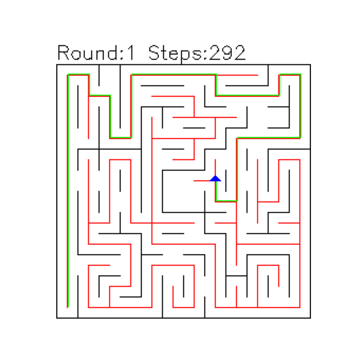
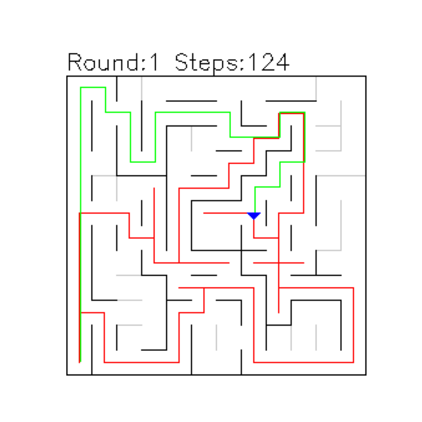

# Udacity DSND Capstone - Robot Motion Planning Capstone Project
# Project definition
## Project Overview
The goal of this project was to design and implement a virtual robot that could navigate through a virtual maze and find the center of the maze as quickly as possible. The project was inspired by [Micromouse competitions](https://en.wikipedia.org/wiki/Micromouse), in which a robot mouse is tasked with finding the center of a maze and optimizing its path to the center.

We evaluated the performance of our solution by testing it on a series of test mazes and measuring the time it took for the robot to reach the center of the maze. We also evaluated the efficiency of our code, including the number of time steps and the final score. In the following sections, we will discuss the analysis, methodology, and results of our project in more detail.

For a detailed project specifications document please see the following link: [Udacity project specifications](https://docs.google.com/document/d/1ZFCH6jS3A5At7_v5IUM5OpAXJYiutFuSIjTzV_E-vdE/pub)

## Problem statement
The problem that we are trying to solve is to design and implement a virtual robot that can navigate through a virtual maze and find the center of the maze as quickly as possible. The robot is provided with sensor readings in 3 directions, left front and right, indicating the number of open squares in the direction of the sensor, and it is able to rotate 90 degrees right or left and move forward a distance of up to three units on each time step of the simulation. The robot starts in the bottom-left corner of the maze and must navigate to the center of the maze, which is represented as a 2x2 square in the center of the grid. The maze is represented as a grid of 12x12, 14x14 or 16x16 squares, with walls blocking certain edges of the squares. 

The maze that we are trying to solve is initially unexplored, meaning that the robot does not have any information about the layout of the walls and open squares in the maze. In order to find the center of the maze and optimize its path to the center, the robot must first explore the maze and gather information about its layout. Once the robot has completed a mapping run of the maze, it will have a good understanding of the layout of the maze and will be able to use this information to plan a fast and efficient path to the center.

## Metrics
In this project, a time step represents a single unit of time during which the robot can take an action. Time steps are used to simulate the passage of time and to limit the amount of processing that the robot can do on each time step. During each time step, the robot can choose to rotate clockwise or counterclockwise by 90 degrees and move forward a distance of up to three units.

To evaluate the performance of the robot, we will use three metrics: 

1. Exploration - The number of time steps it takes for the robot to complete a mapping run of the maze.
1. Navigation - The number of time steps it takes for the robot to navigate from the starting square to the center of the maze after the mapping run.
1. Score - Combines the time steps for the mapping run and the navigation run. The score is calculated with the following formula: 
    
    *Score = (Exploration time steps)/30 + (Navigation time steps)*
    
    This score allows us to compare the performance of different algorithms and choose the one that performs the best in terms of overall speed and efficiency.

# Analysis
## Maze solving algorithms
There are various algorithms that can be utilized to solve mazes, including wall follower, depth first search, best first search, Dijkstra, A*, and Flood Fill. In this section, we will evaluate the aforementioned algorithms and assess their suitability for addressing the problem at hand.

### Wall follower 
   
The wall follower algorithm involves following the left or right wall of the maze until the center of the maze is reached. This algorithm is simple to implement and can be effective in mazes with long corridors, but it may get stuck in loops or dead ends and may not always find the optimal path to the center. We did not use the wall follower algorithm in this project specifically because many of the Micromouse mazes are not solvable using the wall follower algorithm.

### Depth first search  

Depth first search (DFS) involves exploring the maze by moving as deep as possible into the maze before backtracking and exploring other paths. DFS can be implemented using a stack data structure to store the unexplored paths. We used DFS in this project with relatively few adjustments.

### Best first search 

Best first search involves exploring the maze by prioritizing paths that are more likely to lead to the center of the maze. This can be done using a priority queue data structure to store the unexplored paths, with the priority based on the estimated distance to the center of the maze. 
One challenge that arose when implementing the best first search algorithm for this project was the difference between the algorithm's rapid movement between positions and the static nature of the robot, which can only move relative to its current position. To address this challenge, we modified the best first search algorithm by incorporating depth first search and adding a heuristic function that calculates the distance to the goal for all neighboring cells. This allowed the robot to make more informed decisions and choose the path that is closest to the goal, leading to a more efficient solution. We anticipated that this modified best first search algorithm would enable the robot to reach the center of the maze quickly.

### Dijkstra’s algorithm 

Dijkstra's algorithm is a graph search algorithm that can be used to find the shortest path between two nodes in a graph. It works by starting at a given node and gradually exploring the graph by adding the shortest paths to a set of visited nodes. Dijkstra's algorithm uses a priority queue data structure to store the unexplored nodes, with the priority based on the shortest path to the starting node. To adapt Dijkstra's algorithm for use in this project, we implemented depth first search and added the score and parent properties to the visited cells in order to track the optimal route through the maze. Like the best first search algorithm, Dijkstra's algorithm involves rapid movement between positions in order to find the optimal path. However, by incorporating depth first search and tracking the visited cells, we hoped to discover the most efficient route through the maze after it had been fully explored..

### A\* (A star) 

A\* is an extension of Dijkstra's algorithm that uses an additional heuristic function to estimate the remaining distance to the goal and prioritize paths that are more likely to lead to the goal. A\* can be more efficient than Dijkstra's algorithm since it avoids exploring paths that are unlikely to be optimal.
We chose not to use the A\* algorithm in this project, since we implemented Dijkstra's algorithm using depth first search and already added a heuristic function to the modified best first search algorithm, using A\* would have resulted in a solution that was too similar to this existing approaches. Therefore, we decided to focus on other algorithms and techniques to solve the maze in the given context.

### Flood Fill algorithm 

Flood Fill is an algorithm that involves filling an area with a color or value and propagating the filling to adjacent areas that have not been colored or assigned a value. It works by starting at a given location and gradually exploring the surrounding area, coloring or assigning values to each visited location. Flood Fill uses a recursive approach, in which the algorithm calls itself on each of the adjacent locations until the entire area has been filled.
We found that the Flood Fill algorithm is commonly used in Micromouse competitions and is particularly well-suited for solving Micromouse mazes and did not require any modifications to be effective in the given context. The adaptability of Flood Fill in handling the constraints and requirements of pathfinding in an unexplored maze made it an ideal choice for solving the problem at hand.

### Modified Flood Fill 

Due to the limited number of maze runs allowed by the project specifications, and the fact that the Flood Fill algorithm typically requires multiple runs to optimize its performance, we decided to improve the algorithm by adding an additional logic layer for the exploration phase. This layer allows the robot to continually test whether the optimal route from the start to the goal has been fully explored, and only ends the exploration phase when there are no unvisited cells in the optimal route. By doing so, we aimed to minimize the number of time steps required for the exploration phase while guaranteeing an optimal route from the start to the goal.

## Maze exploration

In this section, we will analyze the approach that each algorithm takes to map and explore a test maze. We will start by describing the layout of the maze and the starting position of the robot. We will then describe the mapping run of each algorithm, including the sequence of actions taken by the robot and the information gathered about the layout of the maze. We will also present visualizations of the robot's progress through the maze and discuss any notable features or challenges it faced.

### Maze overview

For our first experiment, we used a 12x12 maze which is the first test maze supplied with the project (test\_maze\_01.txt). The robot was placed at the bottom left corner, as shown in the following figure:

In the following images black walls represent explored walls and grey walls represent unexplored walls.

### Depth first search
  

As demonstrated in the above figure, the DFS algorithm explored a significant portion of the maze before reaching the goal. This behavior is characteristic of DFS, which is an uninformed algorithm that relies on the predetermined priority of intersection exploration (forward, then right, then left in this case). Despite its simplicity, the DFS algorithm was able to successfully navigate the maze and reach the goal in under the threshold of 1000 time steps.

### Best first search

As demonstrated in the above figure, we modified the DFS algorithm by incorporating a heuristic distance function to guide the exploration. This modified version of DFS was able to reach the goal in significantly fewer time steps than the original, uninformed version. This demonstrates the effectiveness of incorporating heuristics into maze solving algorithms, as it allows the robot to make more informed decisions and optimize its path to the goal.

### Dijkstra’s algorithm

As demonstrated in the above figure, Dijkstra's algorithm maps the entire maze in order to determine the optimal route from the start to the goal. In this particular case, we can observe that the algorithm continued to explore the maze even after reaching the goal, resulting in a high number of time steps. This is due to the fact that Dijkstra's algorithm is designed to find the shortest path between two points, and this can only be guarenteed by traversing through all of the available points in the graph.

### Flood Fill

As demonstrated in the above figure, the Flood Fill algorithm was able to exploring a significant portion of the maze efficiently and reaching the goal before returning to the start. In this particular case, the algorithm explored two different paths from the start to the goal. This behavior is due to the fact that the Flood Fill algorithm is designed to find the optimal route, and in unexplored areas it assumes that there are no walls. As a result, after finding the goal, the algorithm chose to explore another path in search of a potentially better route. However, it is important to note that this approach will not necessarily guarantee the most optimal route, as the algorithm is only given one exploration run and explores 2 paths from the start to the goal and vice-versa.

### Modified Flood Fill

As demonstrated in the above figure, the modified Flood Fill algorithm explores a greater portion of the maze in order to ensure that the optimal route is found, resulting in longer exploration time steps. However, this approach might lead to shorter second run time steps, as the algorithm is able to take the most efficient path through the maze. This tradeoff between the exploration and navigation runs might be beneficial in terms of optimizing the overall score, since the navigation run is penalized 30 times more heavily than the exploration run. By exploring more of the maze during the exploration run, the modified Flood Fill algorithm might be able to minimize the number of time steps required during the navigtaion run and achieve a lower overall score.

## Benchmark

In order to determine a reasonable benchmark score for our robot's performance in the maze solving task, we need to consider several factors.

First, we need to consider the time constraints of the task. In this case, we have been given a maximum of 1000 time steps for both the mapping and navigation runs. This means that our robot will need to complete both of these tasks within this time limit in order to be considered a successful solution.

Next, we need to consider the complexity of the maze. If the maze is relatively simple and easy to navigate, we might expect our robot to complete both the mapping and navigation runs in fewer time steps. On the other hand, if the maze is more complex and difficult to navigate, we might expect our robot to take more time steps to complete the runs.

Finally, we need to consider the efficiency of our robot's algorithms and the overall performance of our solution. If our robot is able to quickly and accurately map the maze and find the optimal path to the center, we might expect it to have a lower score compared to a solution that takes longer to complete the runs.

Based on the knowledge we have gathered so far, it is likely that different algorithms will perform differently in terms of their ability to solve the maze and find the center as quickly and efficiently as possible. For example, algorithms that rely on a systematic search of the maze, such as depth first search, may be less effective in mazes with complex layouts and many possible paths. These algorithms may take longer to complete the mapping run, and more likely to find a suboptimal path to the center.

On the other hand, algorithms that use heuristics to guide their search, such as Best first search, may be more efficient at finding the center. However, these algorithms may not be very effective in finding the optimal path due to their greedy nature.

Finally, the Flood Fill algorithm may be efficient at filling in the maze, but it has a caveat of not being able to consistently find the optimal path to the center. This is the reason we added an modified Flood Fill algorithm, which we expect to have a lower score even if it has a higher time step count on the exploration round.

Overall, the different algorithms’ performance will depend on the specific characteristics of the maze and the efficiency of the implementation. However, by testing each algorithm on a series of test mazes and comparing the results, we can gain a better understanding of their relative performance and choose the ones that performs the best in terms of speed and efficiency.

# Methodology

## Data Preprocessing

In this project, no data preprocessing was necessary because the sensor specifications and environment designs were provided to us. All of the necessary information about the layout of the maze and the capabilities of the robot's sensors was already included in the project specifications. There was no need to perform any data cleaning or transformation in order to use this information to solve the maze. This simplified the development process and allowed us to focus on the core challenges of the project, such as exploring the maze, mapping its layout, and finding the optimal path to the center.

## Implementation

### Project files overview

In the implementation phase of this project, we used python 3.10.8 and the Jupyter for VSCode extension to develop our solution. We also utilized the numpy library for the maze logic, matplotlib and cv2 for visualizations, ipywidgets for debugging via Jupyter, and pandas and seaborn for analyzing the final results. The provided scripts and input data were used to design and implement algorithms for solving the maze.

We began by modifying the **robot.py** script to establish the robot class and define the necessary functions for navigating the maze. In order to facilitate the comparison of various algorithms, the ability to choose the algorithm to be used at runtime was added. A simplification layer was also implemented, allowing for communication with the algorithms using position coordinates rather than sensor input. This simplification allows the algorithm to consider only the current position and layout of the maze, returning the position the robot should move to next. The implementation of this layer facilitated the development and debugging of the algorithms by eliminating the need to consider the details of sensor reading gathering and robot movement through the maze.

We also made use of the **maze.py** script, which provided functions for constructing the maze and checking for walls when the robot moved. These functions allowed us to accurately simulate the behavior of the robot and the layout of the maze.

To test the performance of our algorithms, we used the **tester.py** script, which allowed us to run the robot through a series of test mazes. In order to increase the number of mazes available for testing, we added additional mazes from [this link](https://github.com/micromouseonline/micromouse_maze_tool/tree/master/mazefiles/binary) and implemented the functionality to read them. We also upgraded the code to be compatible with python 3 and added a second parameter for choosing the algorithm from command line.

During the development process, the **showmaze.py** script was not used as we were working within the Jupyter environment. Instead, we utilized matplotlib and cv2 to visualize the mazes and the robot's path through them. These libraries allowed us to easily create graphical representations of the mazes and track the progress of the robot as it navigated through them, as can be seen in **robot.ipynb** notebook.

In this project, we implemented a number of classes to solve the maze using different algorithms. These classes all inherited from the **Robot** class and made movement decisions using the robot's position and maze layout. Below, we will provide an overview of each of these classes and describe their specific roles and functions in the project.

### Robot class

This is a base class which handles common actions for all algorithms. It initializes rounds and mazes, updates the step counter and logs previous steps for future analysis and visualization, updates the position, rotation and maze memory as discovered, and filters moves blocked by walls for the chosen algorithm and handles reset responses. It has various dictionaries for direction and rotation, a list of goals, and variables for the current position and movement. It has several functions for initializing a new step, getting a position's adjacent cells, checking for a reset conditions, and resetting rounds. It also has two abstract functions for the chosen algorithm to decide the next move during exploration and navigation. This class also provides a simplification layer to the algorithms and communicates with position coordinates only. It then handles the low level rotations and movements itself.

### DFS class

This class implements the depth first search algorithm for solving the maze. It involves exploring the maze in a recursive, depth-first manner and backtracking when it reaches a dead end or a previously visited square. 

The logic involves arbitrarily choosing a route until it is blocked, then backtracking until it finds an unvisited neighbor to continue exploring. The stop condition for the algorithm is reaching the destination. The class has several methods, including *algo\_exploration*, which chooses the next move based on whether there are any unvisited neighbors and *algo\_victory*, which determines the path to take once the destination has been reached.

### Best first search class

This class implements the depth first search algorithm with the addition of a heuristic function that calculates the distance to the goal for all neighboring cells. This allows the algorithm to choose the cell that is closest to the goal for the next move, possibly leading to a more efficient solution.

This class uses a heuristic function, either Manhattan distance or Euclidean distance, to choose the next move based on which path is closest to the goal. The algorithm then proceeds in a similar manner to the standard depth first search algorithm, exploring and backtracking as necessary. The stop condition for the algorithm is reaching the destination. The class has several methods, including *proceed*, which sorts the potential next moves based on their distance to the goal and *dist\_to\_goal*, which calculates the distance between a given position and the goal. There are also methods for calculating the Manhattan and Euclidean distances between two positions.

### Dijkstra class

The Dijkstra class is an implementation of Dijkstra's algorithm, which is an uninformed search algorithm used to find the shortest path between two points in a graph. In this case, it is being used to navigate a maze. The class extends the DFS class, which allows it to map the entire maze on the first run and then use the mapped data to find the optimal path to the center of the maze on the second run. 

The Dijkstra class includes a function called *update\_neighbours*, which updates the score of each cell in the maze based on its distance from the start position. It also includes a *check\_reset\_condition* function, which checks if all cells in the maze have been visited. If the reset condition is met, the *victory\_route* is calculated by tracing back from the center of the maze to the start position using the parent data stored in the *maze\_data* array.

### FloodFill class

The FloodFill class is an algorithm for finding a path through a maze that involves assigning a value to each cell in the maze based on its distance from the goal. On the first run, it will explore the maze by assigning values to cells and choosing the next move based on the lowest value of the available, unblocked neighbors. When it reaches the goal, it will assign a value of 0 to the goal cell and add 1 to each of its unblocked neighbors. It will then explore the maze again, using the values assigned to cells to find the most efficient path to the goal. The algorithm will stop when it has found a path from the start to the goal and back to the start.

The main functions in this class include *algo\_exploration*, which determines the next move based on the lowest value of the available unblocked neighbors, *check\_reset\_condition*, which determines whether the algorithm has reached the goal and initiates the route back to the start and *set\_new\_goals* which initiates the Flood Fill algorithm starting from a specified position.

### Modified Flood Fill class

The FloodFillExploratory class is an extension of the FloodFill class, with the added ability to perform multiple runs until it is certain that the optimal path from the start to the goal is available. The main logic for this optimization is implemented in the *check\_reset\_condition* method, which simulates the optimal route from start to finish and checks if all cells in it have been visited. If all cells in the simulated route have been visited, the algorithm considers the route to be fully explored and sets the "reset" condition to True, indicating that the exploration process is complete. If there are still unvisited cells in the simulated route, the algorithm continues exploration by setting new goals for the Flood Fill algorithm and repeating the simulation until the optimal route is fully explored.

## Refinement

In the process of developing the optimal solution for navigating a maze, a number of refinements were made to the initial algorithms and techniques.

One challenge that arose when implementing maze solving algorithms for this project was the difference between the algorithm's rapid movement between positions and the static nature of the robot, which can only move relative to its current position. To address this challenge, we had to modify the following algorithms in the following ways:

**Depth first search** algorithm was slightly modified to backtrack when stuck instead of skipping to the last intersection. This slight modification has no implication on the algorithm’s performance.

**Best first search** algorithm was modified to incorporate depth first search while adding a heuristic function that calculates the distance to the goal for all neighboring cells. This allowed the robot to make more informed decisions and choose the path that is closest to the goal, leading to a more efficient solution.

**Dijkstra** was modified to incorporate depth first search and map the entire maze on the exploration run and then use the mapped data to find the optimal path to the center of the maze on the navigation run.

**Flood Fill** was not modified but could not guarantee an optimal path as it did not account for the possibility of multiple paths to the goal. To address this issue, we developed a modified version of Flood Fill called **Flood FillExploratory**. This algorithm operates in a similar manner to Flood Fill, but it performs the route from start to finish and back more than twice until it is sure the path is available. This allows the algorithm to account for the possibility of multiple paths and ensures that the optimal route is selected.

# Results

## Test maze results

In this section, we present the results of our full maze run on the maze *test\_maze\_01.txt* for all 5 algorithms. We used 3 metrics to evaluate the performance of the algorithms: the number of time steps it takes for the robot to complete a mapping run of the maze, the number of time steps it takes for the robot to navigate from the starting square to the center of the maze after the mapping run, and a score that combines the time steps for the mapping run and the navigation run. We used these metrics to compare the performance of the different algorithms and visualize the path each algorithm chose in order to better understand which one fits better with our project goal of optimizing overall speed and efficiency.

### Depth first search

The Depth First Search (DFS) algorithm achieved the highest score of **50.4**, with a very long exploration run at **252** steps and a suboptimal navigation run at **42** steps. This is likely due to the uninformed nature of the DFS algorithm, which relies on sheer luck to stumble upon the goal. In this case, the DFS algorithm required a significant amount of exploration and eventually reached a suboptimal path.

### Best first search

The BestFirst algorithm achieved a score of **48.8**, which is significantly higher than the other algorithms tested. While it had the shortest total number of time steps at **72** for exploration and **46** for navigation, the algorithm was unable to find the optimal path to the center. This may be due to the fact that the BestFirst algorithm prioritizes paths that are more likely to lead to the goal, but this may not always result in the optimal solution. In this case, the algorithm was able to find the goal relatively quickly, but the chosen route was not the most efficient.

### Dijkstra’s algorithm

Dijkstra's algorithm achieved a score of **39.7**, which is relatively close to the Flood Fill algorithms below. This is due in part to the Dijkstra's ability to find the optimal path in the navigation phase, requiring only **30** steps. However, Dijkstra's algorithm has a drawback in that it requires mapping the entire maze in order to find the optimal path. This is evident in the high number of exploration steps required at **293**, which was the highest among all of the algorithms tested. While Dijkstra's algorithm was able to find the optimal path in the navigation phase, the cost of this efficiency was a significantly longer exploration phase and thus a higher score.

### Flood Fill

The Flood Fill algorithm had the second best score at **37.1** and a relatively quick exploration run at **92** steps. However, it was unable to find the optimal path in the navigation phase, requiring **34** steps. This may be due to the project constraints, which only allowed for one exploration run. It is possible that the Flood Fill algorithm would have performed better with additional exploration runs, as it is known to require multiple runs to find the optimal path in some cases.

### Modified Flood Fill
   

The modified Flood Fill algorithm achieved the lowest score at **36.3** with only **30** navigation steps. While it required a significantly higher number of exploration steps at **189**, this was expected and aligned with the project goals. In this example, by modifying the Flood Fill algorithm, we were able to achieve a lower score, despite the increased exploration time.

### Test maze results comparison

The above graph displays a comparison of the performance of each algorithm in terms of exploration, navigation, and overall score. It is important to note that lower results are better in this context.

## Free-Form Visualization

In this section, we will present the aggregated results of running all of the above algorithms across a set of **401 different mazes**. This will allow us to get a more comprehensive understanding of how each algorithm operates and how it performs on a larger scale. By analyzing the aggregated results, we can identify trends and patterns that may not have been apparent in the individual results presented earlier. This might provide insights into the strengths and weaknesses of each algorithm and help us to identify the best overall solution for solving the maze.

The visualizations below show the mean scores and steps for running across all 401 mazes, as well as the minimum, median, and maximum values out of all algorithms.

### Exploration run comparison

**Notable observations:**

- **Dijkstra’s** algorithm consistently has the longest exploration run, reaching almost the maximum value in most cases.
- Both the **modified Flood Fill** algorithm and the **DFS** algorithm have similar exploration lengths, which are slightly higher than the median value.
- There is a roughly 30% difference in the exploration lengths of the **Flood Fill** and **Modified Flood Fill** algorithms. While this difference is not insignificant, it is not necessarily significant if the Modified Flood Fill algorithm demonstrates a meaningful reduction in the navigation run.
- The **BestFirst** algorithm has the shortest exploration run, but it is often not the fastest in all mazes, as it is somewhat far from the minimum value.

### Navigation run comparison

**Notable observations:**

- The **modified Flood Fill** algorithm consistently outperforms the other algorithms on the navigation run, with a mean time steps value slightly above to the minimum line.
- **Dijkstra's** algorithm is not performing as well as the modified Flood Fill in terms of finding the optimal path in the maze, which is not as expected. This could potentially be due to an implementation issue or a compatibility issue with the algorithm and unexplored mazes.
- The **Flood Fill** algorithm appears to perform consistently, with results that are close to the median line. This suggests that this algorithm performs at a consistent level across all mazes.
- **BestFirst** and **DFS** have the longest navigation runs, with BestFirst having the advantage of being an informed algorithm and thus more efficient runs.

### Total score comparison

**Notable observations:**

- The **modified Flood Fill** algorithm consistently outperforms the other algorithms in terms of score, with a value slightly above to the minimum line.
- The **Flood Fill** algorithm has a lower score than the median, which suggests that it consistently outperforms most other algorithms.
- **Dijkstra's** algorithm was found to be above the median in terms of score, indicating that the tradeoff between a very high exploration run and a relatively short navigation run may not be optimal in this case.
- **BestFirst** and **DFS** have the highest scores, with DFS showing much higher scores than the rest of the algorithms.

## Justification

In this chapter, we will delve into the details of the final results of the performance of each algorithm and analyze the reasons why some techniques were more successful than others. We will also consider the limitations of the project and how they may have affected the results.

As we analyzed the results of our experiments, it became clear that the **modified Flood Fill** algorithm outperformed the other algorithms in terms of speed and efficiency. This was particularly evident in the score analysis, where the modified Flood Fill algorithm consistently had the lowest scores. This can be attributed to the longer exploration run, which ensured an optimal path in the navigation phase. This is also due to the fact that the navigation phase time steps are penalized 30 times more heavily than exploration phase time steps. For other score calculations with a lower penalization factor, this tradeoff may not be as effective.

The **Flood Fill** algorithm demonstrated a strong performance in the exploration phase, with a mean score that was below the median line. However, its score in the navigation phase was slightly above the median line, indicating that it was not as effective at finding the optimal path as some of the other algorithms. This can be attributed to the fact that Flood Fill algorithms often require multiple runs in order to find the optimal path, while in this project we only allowed for a single exploration run. If additional exploration runs were allowed, we would expect this algorithm to perform even better in terms of finding the optimal path in the navigation phase. 

**Dijkstra’s** algorithm performed relatively well in terms of finding the optimal path, with a mean navigation run below the median line. However, it had a very high exploration run, which resulted in a score that was slightly above the median line. This suggests that the exploring the entire maze to find the optimal path might not be the most efficient solution in certain contexts. A potential issue that could have affected the performance of the Dijkstra algorithm is an implementation issue or a compatibility issue with unexplored mazes, as we expected the algorithm to more efficiently identify the optimal path. 

The **BestFirst** algorithm showed strong results in the exploration phase, due to the heuristic function allowing it to quickly reach the goal. However, it struggled in the navigation phase, often requiring a longer time to find the goal. This can be attributed to the greedy nature of the algorithm, which relies on a heuristic function to guide its search without trying to search for a better path. 

The results for the **DFS** algorithm showed it consistently performing poorly compared to the other algorithms. Its high score can be attributed to its long exploration run and suboptimal navigation path suggests that the algorithm is not well-suited for solving this particular type of maze. This is likely due to the uninformed nature of the DFS algorithm, which relies on randomly exploring the maze rather than using any specific strategy or information about the layout of the maze. As a result, the DFS algorithm is highly reliant on luck and is unlikely to consistently find the optimal solution.

# Conclusion

## Reflection

In this project, we set out to find the optimal solution for navigating a maze using various algorithms and finding the optimal path to the center of the maze. Throughout the development process, we encountered a number of challenges and opportunities for learning and growth.

One of the most interesting aspects of this project was the challenge of adapting search algorithms to a simulated physical maze as robot. It required us to consider the limitations and capabilities of the robot's sensors and movement, as well as the layout and properties of the maze itself. This added an additional layer of complexity to the project and required us to think creatively on how to solve the problem. For example, we had to consider the limitations of the robot's movement when implementing algorithms like BestFirst and Dijkstra, which typically involve rapid position movement. To overcome this issue, we modified these algorithms by basing them on the DFS algorithm and adding their unique characteristics, such as BestFirst's heuristic function and Dijkstra's scoring and parent system. This allowed us to find a more efficient path to the goal while still considering the limitations of the robot's movement.

Another aspect of the project we found challenging was optimizing the performance of the algorithms. It was interesting trying different approaches and comparing the results in order to find the most efficient solution. This required a lot of trial and error and careful analysis of the data in order to identify the best approach. For example, when using the Flood Fill algorithm, we were unable to consistently find an optimal path due to the constraints of having only one exploration run. This required us to consider modifications to the algorithm which could guarantee an optimal path, while still being worth the tradeoff of longer exploration time steps.

Overall, this project was a great opportunity to learn about different maze solving algorithms and their strengths and weaknesses. It was also a chance to practice implementing and testing algorithms, as well as analyzing and interpreting the results.

## Improvement

One potential improvement would be to adjust the exploration strategy logic. For example, the modified Flood Fill and Dijkstra’s algorithms could be improved by optimizing the mapping process to reduce the overall exploration time. This could involve adjusting the algorithm's implementation or utilizing more efficient data structures to store and process the maze information. 

An additional potential issue that could be causing Dijkstra's algorithm to not consistently find the most optimal path might be the way in which it is implemented. It is possible that the algorithm is not properly calculating the shortest path to the goal, or that it is getting stuck in certain areas of the maze. To improve the performance of this algorithm, it would be worth examining the way in which it is implemented and identifying any potential issues or areas for optimization.

A final potential improvement would be to modify the movement of the robot to allow it to move more than one cell at a time. The current implementation allows the robot to only move one cell at a time, which can be inefficient in terms of exploration and specifically navigation. By allowing the robot to move up to three cells at a time, we could potentially reduce the number of time steps required to explore and navigate the maze, leading to improved performance for all algorithms. This improvement could be achieved by adding a logic that allows for longer movements in explored parts and incorporating it into the algorithms. It would be interesting to compare the performance of the algorithms with this improvement to the current implementation to see if there is a significant difference in the results.

While not an improvement, a potential modification to improve the performance of certain algorithms would be to allow for multiple exploration runs. As seen in the results, the Flood Fill algorithm struggled to find the optimal path within a single exploration run. However, allowing for additional exploration runs could potentially improve the algorithm's ability to map the maze and find an optimal path. This modification may also affect the performance of algorithms such as BestFirst and may require some algorithm modifications.

Overall, while there are potential improvements that could be made to the implementation of the algorithms, it is important to carefully consider the potential drawbacks and determine whether the benefits outweigh the potential issues. By carefully analyzing the results and identifying areas for improvement, it is possible to continually improve the performance of the algorithms and achieve better results in solving mazes. 